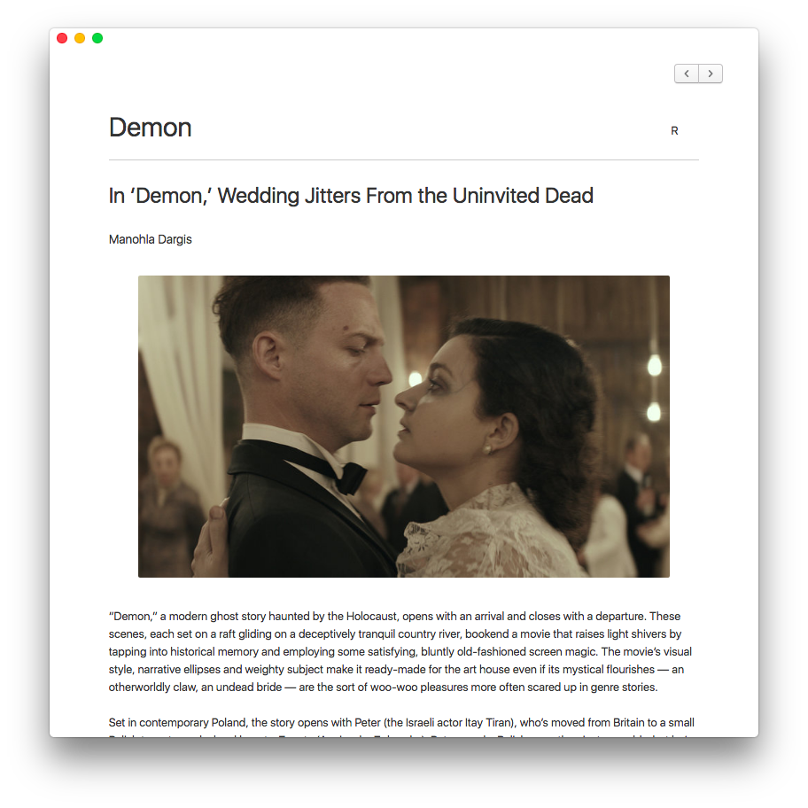

# Filmr

Filmr is an app written in JS, HTML and CSS that utilizes Electron to provide a simple and quick dashboard interface for the New York Times's Film Review section.



## Download

Download [here](https://github.com/BenP51/Filmr/releases)

## Development

```
git clone https://github.com/BenP51/Filmr.git

cd ./Filmr

npm install
```
## License

This project is licensed under the terms of the [MIT license](https://github.com/BenP51/Filmr/blob/master/LICENSE).
